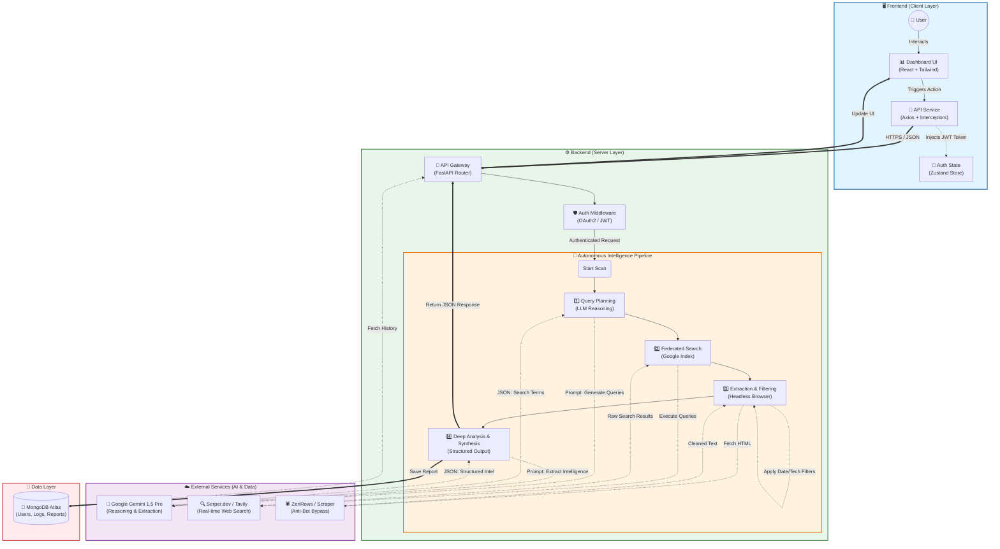

# ScoutIQ - Autonomous Market Intelligence Agent
## High-Level Architecture Diagram

This diagram provides a comprehensive view of the ScoutIQ system architecture, illustrating the end-to-end data flow from user interaction to autonomous intelligence generation.

## Key Components Breakdown

### 1. Frontend (Client Layer)
-   **Dashboard UI**: The command center where users initiate scans and view results. Built with **React** and **Tailwind CSS**.
-   **API Service**: Handles communication with the backend, managing authentication tokens automatically via interceptors.

### 2. Backend (Server Layer)
-   **FastAPI Gateway**: High-performance asynchronous server processing requests.
-   **Auth Middleware**: Secures endpoints using **OAuth2** and **JWT**, ensuring only authorized users can access intelligence features.

### 3. Intelligence Pipeline (The "Agent")
This is the core differentiator. It executes a strict **5-Step Deterministic Protocol**:
1.  **Query Planning**: The agent uses **Gemini 1.5 Pro** to "think" of the best search terms to find technical updates (avoiding generic marketing jargon).
2.  **Federated Search**: Executes these queries in parallel using **Serper/Tavily** to find high-authority sources.
3.  **Extraction (Scraping)**: Uses **ZenRows** to bypass bot protections and scrape the full content of pages. It strictly filters out content older than 7 days.
4.  **Deep Analysis**: Feeds the raw text back into **Gemini 1.5 Pro** with strict instructions to extract *only* valid technical updates (APIs, SDKs, Security Patches) and discard everything else.
5.  **Synthesis**: Formats the output into a strict JSON schema that the frontend can immediately render.

### 4. External Services
-   **Google Gemini 1.5 Pro**: The "Brain" for reasoning and structured data extraction.
-   **Serper.dev**: The "Eyes" for real-time access to the Google Search Index.
-   **ZenRows**: The "Hands" for navigating complex, JS-heavy websites.
-   **MongoDB Atlas**: The "Memory" for storing user profiles and historical intelligence reports.
