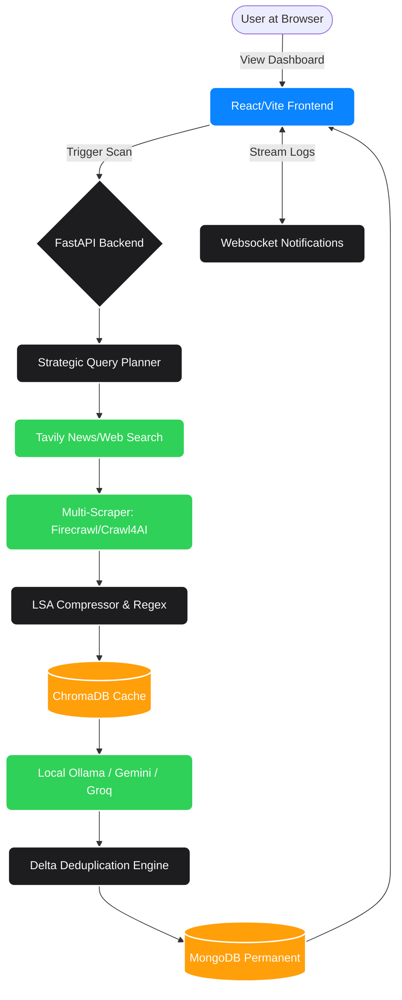

# 🦅 SCOUTIQ: Autonomous Competitive Intelligence Platform

**ScoutIQ** (Market Scout Agent) is a state-of-the-art AI-driven market intelligence platform designed for the modern enterprise. It empowers organizations to monitor competitors, track technical releases, and synthesize strategic intelligence with surgical precision. By leveraging an autonomous agentic architecture with a **Local AI-First** approach, ScoutIQ eliminates hallucinations and delivers 100% verified, data-driven insights.

---

## 💎 CORE MISSION: Total Data Integrity
ScoutIQ has been rigorously engineered to eliminate "mock data" or "synthetic fallbacks." Every metric, timeline event, and intelligence report is derived from **real database records** and **dynamic technical scans**. 
- **100% Real Activity Timeline**: No mock events; every entry is a persisted technical discovery or scan report.
- **Deterministic Analytics**: Metrics such as system latency and risk scores are calculated in real-time based on your specific intelligence footprint.
- **Local AI Resilience**: Engineered to run on local models (Ollama) with ChromaDB for caching, ensuring resilience even with low RAM or unreliable internet.

---

## 🏗 System Architecture

The platform is split into a **React/Vite Frontend** (for sleek visualization) and a **FastAPI Backend** (the heavy-lifting AI engine). They communicate via REST APIs and real-time WebSockets.

### 🔄 The 6-Step Autonomous Agent Workflow
When a scan is triggered, the backend executes this massive sequence in real-time:

1. **Query Planning:** The Local LLM (Ollama) acts as a strategic planner, breaking down the target company into focused search requests.
2. **Search Discovery:** Secure requests via the **Tavily API** (or fallback providers) bounded by recent timeframes.
3. **Headless Scraping:** Bypassing strict bot guards using **Crawl4AI** and **Firecrawl** to fetch pure Text/Markdown.
4. **Data Compression:** Useless info is thrown out. **LSA Compressor** shrinks remaining data, and it's cached in a local **ChromaDB** vector database.
5. **AI Synthesis:** The massive block of compressed evidence is passed to the **Summarizer Agent** (Ollama/Groq/Gemini). The AI responds dynamically in a strictly structured JSON format.
6. **Delta Verification:** The backend hashes the newly built JSON data and compares it against **MongoDB**. Only new, verified updates are persisted and logged.



---

## 🛠 Advanced Tech Stack

| Layer | Technologies |
| :--- | :--- |
| **Frontend** | React 18, Vite, TypeScript, TailwindCSS, Framer Motion, Zustand, Recharts |
| **Backend Core** | Python 3.10+, FastAPI, MongoDB (Motor), Redis |
| **Intelligence Engine**| Ollama (Local Llama 3 / Phi-3), Gemini 1.5 Pro, Llama 3 (Groq) |
| **Scraper Suite** | Firecrawl, Crawl4AI, Trafilatura, BeautifulSoup |
| **Vector Cache** | ChromaDB |
| **Real-time** | Authenticated WebSockets for live telemetry |
| **Export Engine** | JSPDF + HTML2Canvas for dynamic intelligence reports |

---

## 📊 High-Performance Dashboard
- **Glassmorphic UI**: Ultra-premium, dark-mode focused interface built with Framer Motion and TailwindCSS.
- **Live Agent Logs**: Watch the AI work in real-time via authenticated WebSockets.
- **Market Comparison**: Side-by-side technical velocity analysis for your target universe.

---

## 📂 Project Directory Breakdown

```text
Market_Scout_Agent_Final/
├── frontend/                # 🎨 Visual Interface (React/Vite)
│   ├── src/components/      # UI Elements (Charts, Timelines, Buttons)
│   ├── src/features/        # Main Dashboard Logic
│   ├── src/store/           # Global State (Zustand)
│   └── src/services/        # API Connectors & WebSocket clients
│
├── backend/                 # 🧠 The Core Intelligence Engine (Python/FastAPI)
│   ├── app/main.py          # Gateway initialization and routing
│   │
│   ├── app/api/             # 🔌 Communication Endpoints
│   │   ├── scan.py          # Triggers the massive agent workflow
│   │   ├── websockets.py    # Streams real-time terminal logs to UI
│   │   └── ...
│   │
│   ├── app/services/        # ⚙️ The Heavy Lifters (Business Logic)
│   │   ├── search_service.py      # Connects to Tavily API
│   │   ├── multi_scraper.py       # Scrapes webpages
│   │   ├── vector_cache.py        # ChromaDB Cache operations
│   │   ├── delta_engine.py        # Deduplicates features
│   │   └── ollama_sync.py         # Connects to Local LLaMA / Phi3
│   │
│   └── app/core/            # 🔐 System Configuration
│       └── config.py        # Loads `.env` secrets
│
└── docs/                    # 📚 Dedicated In-Depth Documentation
```

---

## 🚀 Deployment Guide

### 1. Prerequisites
- **Runtime**: Python 3.10+ and Node.js 18+
- **Database**: MongoDB (Local or Atlas)
- **Local AI**: Ollama installed and running (`ollama run llama3` or `ollama run phi3:mini`)
- **API Keys** (in `.env`):
    - `TAVILY_API_KEY`: Global Search Capability
    - `FIRECRAWL_API_KEY`: Technical Scraping Node (optional)
    - `GEMINI_API_KEY` / `GROQ_API_KEY`: Fallback Synthesis (optional if using pure local)

### 2. Quickstart

**Backend**:
```bash
cd backend
pip install -r requirements.txt
uvicorn app.main:app --reload
```
*(Alternatively, run `./run_backend.sh` for a production-ready startup script)*

**Frontend**:
```bash
cd frontend
npm install
npm run dev
```

---

## 🗺 Verified Technical Milestones ✅
- [x] **Local AI Architecture**: Fully functional planner and summarizer agents utilizing Ollama.
- [x] **Vector Knowledge Caching**: ChromaDB integration for robust local context retrieval.
- [x] **100% Data Authenticity**: All metrics are strictly MongoDB-driven via complex aggregation pipelines.
- [x] **Live WebSocket Telemetry**: Authenticated real-time agent activity logs streaming to the UI.
- [x] **Deterministic Analytics**: Risk, Sentiment, and Latency calculated authentically.
- [x] **Graceful Empty State Handling**: React UI flawlessly handles partial or missing data arrays.

---

Developed with ❤️ by **Deepu Kumar** at **SingularSolution**.
**ScoutIQ v1.0.0-Stable** — *Surveillance you can trust.*
