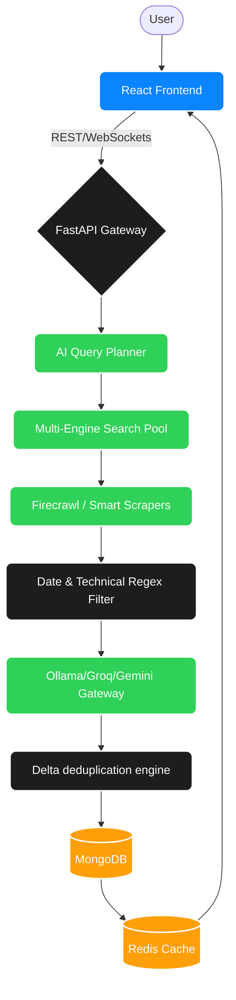

<div align="center">
  <h1>🦅 Market Scout Agent (ScoutIQ)</h1>
  <p><strong>Autonomous Competitive Intelligence & Technical Surveillance Platform</strong></p>
  <p>
    
    
    
    
    
  </p>
</div>

---

## 📖 Table of Contents

1. [🌟 Project Overview & Mission](#-project-overview--mission)
2. [🛠 Complete Technology Stack](#-complete-technology-stack)
3. [✨ Core Features & Capabilities](#-core-features--capabilities)
4. [🏗 System Architecture & Agent Workflow](#-system-architecture--agent-workflow)
5. [📂 Project Directory Structure](#-project-directory-structure)
6. [🚀 Setup & Installation Guide](#-setup--installation-guide)
7. [⚙️ Environment Configuration](#️-environment-configuration)
8. [📡 API Documentation](#-api-documentation)
9. [🌐 Deployment Setup](#-deployment-setup)
10. [🛡 Performance, Security & Retention](#-performance-security--retention)
11. [🐛 Troubleshooting](#-troubleshooting)
12. [🤝 Contributing](#-contributing)
13. [📜 License & Maintainer](#-license--maintainer)

---

## 🌟 Project Overview & Mission

**Market Scout Agent (ScoutIQ)** is a production-grade, enterprise-ready AI competitor intelligence platform. It autonomously monitors global markets, scrapes real-time technical updates, synthesizes findings using advanced Large Language Models (LLMs), and presents actionable insights via a high-performance glassmorphic dashboard.

### 💡 The Problem
In fast-moving industries, tracking competitors manually across news sites, technical blogs, and GitHub repositories is impossible. Existing tools suffer from "AI hallucinations," bloated marketing fluff, and outdated data.

### 🎯 The Solution
ScoutIQ operates an autonomous multi-agent pipeline that performs zero-hallucination web scraping, distills technical-only releases, and filters data via a **strict 7-day rolling window**. 

**Core Value Proposition:**
- **Zero Mock Data:** 100% database-driven intelligence verified by source citations.
- **Strict 7-Day Freshness:** All data older than 7 days is systematically purged, ensuring you only see what matters *now*.
- **Local-First AI Logic:** Prioritizes local LLMs (Ollama) for privacy and cost, falling back to Groq and Gemini for high-performance synthesis.

---

## 🛠 Complete Technology Stack

ScoutIQ relies on a robust, decoupled architecture combining a reactive frontend with a highly concurrent Python backend.

**Frontend Core:**
- **Framework:** React 18 / Vite / TypeScript
- **Styling:** TailwindCSS 4 (Glassmorphism & Custom Theming)
- **State Management:** Zustand (Global Store)
- **Animations:** Framer Motion & Three.js (Micro-animations)
- **Charts:** Recharts (Enterprise Data Visualization)

**Backend Core:**
- **Framework:** Python 3.10+ / FastAPI (Async HTTP framework)
- **Database:** MongoDB (Primary Data Store) via Motor Driver
- **Caching:** Redis (Centralized API Caching & Global Metrics)
- **Vector DB:** ChromaDB (Semantic Search & RAG)
- **Validation:** Pydantic v2 (Strict Schema Enforcement)
- **Scheduling:** APScheduler (Automated Cron Jobs & Background Scans)

**AI & Search Integrations:**
- **LLM Gateway:** Ollama (Primary), Groq (Llama-3), Google Gemini 1.5 Pro
- **Search Engine Pool:** Tavily AI, Exa AI, Brave Search, Serper.dev, DuckDuckGo
- **Specialized Search:** Zenserp (Images, YouTube, Maps, Shopping)
- **Scraping Engine:** Firecrawl, Crawl4AI, ScrapingBee, Trafilatura

---

## ✨ Core Features & Capabilities

### 🏢 User & Dashboard Features
- **Real-Time Intelligence Dashboard:** Live tracking of global risk, active competitors, and intelligence velocity.
- **Glassmorphic UI:** A premium, dark-mode focused aesthetic built for enterprise command centers.
- **Activity Timeline:** A live, chronological feed of verified competitor releases with source citations.
- **Dynamic Search & Filtering:** Instantly filter signals across the entire database.
- **Strategic Planning:** AI-generated 30-day strategic roadmaps based on competitor technical shifts.

### 🤖 Automation & Agent Features
- **Dynamic Query Planning:** The AI auto-generates surgical search queries based on the target industry.
- **Multi-Tiered Scraping:** Bypasses anti-bot mechanisms using proxy rotation and intelligent headless crawlers.
- **Automated Summarization:** Extracts only technical signals (APIs, UI, Infrastructure) and discards marketing noise.
- **Delta Engine:** Intelligently detects *new* features by comparing current scans with historical baseline data.

### 🛡 Security & Administration Features
- **Strict 7-Day Data Retention:** An automated cron job permanently purges all data older than 7 days to maintain data freshness.
- **JWT Authentication:** OAuth2-compliant secure login and session management.
- **Credential Masking:** Sensitive URLs and keys are dynamically redacted in production logs.
- **Multi-Channel Alerts:** Integration with Slack, Discord, and Telegram for real-time risk notifications.

---

## 🏗 System Architecture & Agent Workflow

### High-Level System Flow



### The Request Lifecycle
1. **Trigger:** A scan is initiated manually or via APScheduler.
2. **Phase 1 (Strategy):** LLM generates search queries based on the competitor's profile.
3. **Phase 2 (Scraping):** High-speed async requests extract HTML/Markdown from target domains.
4. **Phase 3 (Filtering):** The system strictly enforces the 7-day rule, discarding old timestamps.
5. **Phase 4 (Synthesis):** Ollama or Groq extracts the technical summary and categorizes the risk.
6. **Phase 5 (Persistence):** Data is cached in Redis and stored permanently in MongoDB.

---

## 📂 Project Directory Structure

```text
Market_Scout_Agent_Final/
├── backend/
│   ├── app/
│   │   ├── agents/          # Autonomous agents & orchestrators
│   │   ├── api/             # REST Endpoints (auth, scan, intelligence, github)
│   │   ├── core/            # Config (.env), Database, Security, Logging
│   │   ├── models/          # Pydantic schemas (ScanRequest, User)
│   │   ├── scheduler/       # APScheduler configuration
│   │   ├── scripts/         # Cron scripts (retention_cleanup.py)
│   │   ├── services/        # Business logic (LLM clients, Scraping, Cache)
│   │   └── main.py          # FastAPI application entry point
│   ├── requirements.txt     # Python dependencies
│   ├── .env.example         # Template for environment variables
│   └── run_backend.sh       # Server startup script
│
├── frontend/
│   ├── src/
│   │   ├── components/      # UI components (Charts, Cards, Layouts)
│   │   ├── context/         # React Contexts (Auth, Theme)
│   │   ├── features/        # Main pages (Dashboard, Analytics, Reports)
│   │   ├── services/        # Axios API clients
│   │   └── store/           # Zustand state managers
│   ├── package.json         # Node.js dependencies
│   ├── tailwind.config.js   # TailwindCSS 4 configuration
│   └── vite.config.ts       # Vite bundler config
│
└── docs/                    # Architecture diagrams and API specs
```

---

## 🚀 Setup & Installation Guide

### Prerequisites
- Python 3.10+
- Node.js 18+ & npm
- MongoDB (Local or Atlas URL)
- Redis (Required for Global Metrics and Suggestion caching)
- Ollama (Optional, for local LLM inference)

### 1. Clone the Repository
```bash
git clone https://github.com/Deepukumar12/Market_Scout_Agent_Final.git
cd Market_Scout_Agent_Final
```

### 2. Backend Setup
```bash
cd backend
python3 -m venv venv
source venv/bin/activate  # Windows: venv\Scripts\activate
pip install -r requirements.txt
```

### 3. Environment Configuration
Create the `.env` file in the `backend/` directory from the provided template:
```bash
cp .env.example .env
```
*(Populate your API keys as detailed in the section below).*

### 4. Frontend Setup
```bash
cd ../frontend
npm install
```

### 5. Running the Application (Development)
**Start the Backend:**
```bash
cd backend
source venv/bin/activate
uvicorn app.main:app --reload --host 0.0.0.0 --port 8000
```
**Start the Frontend:**
```bash
cd frontend
npm run dev
```
Access the application at `http://localhost:5173`.

---

## ⚙️ Environment Variables

The system relies on a `.env` file in the `backend/` directory.

**Key Variables Required:**
- `MONGODB_URL`: Connection string to your MongoDB database.
- `REDIS_URL`: Connection string for Redis caching.
- `SECRET_KEY`: Long random string for JWT hashing.
- `LLM_PROVIDER`: Choose between `ollama`, `groq`, or `gemini`.
- `TAVILY_API_KEY`: Primary search provider.
- `FIRECRAWL_API_KEY`: Primary smart scraping provider.
- `ZENSERP_API_KEY`: Specialized search (YouTube/Images).

---

## 📡 API Documentation

FastAPI auto-generates Swagger documentation. Visit `http://localhost:8000/docs` when the backend is running.

### Core Endpoints:
- **`POST /api/v1/auth/login`**: Authenticate and retrieve JWT token.
- **`POST /api/v1/scan`**: Trigger an ad-hoc intelligence scan for a specific competitor.
- **`GET /api/v1/intelligence/stream`**: Retrieve the global stream of feature updates and market signals (Strictly < 7 days).
- **`GET /api/v1/intelligence/dashboard-overview`**: Aggregated data for the main dashboard view.
- **`GET /api/v1/competitors/list`**: Fetch active targets being monitored by the agent.

---

## 🌐 Deployment Setup

### 1. Preparing for Production
- Set `MOCK_MODE=False` in your `.env`.
- Update `ALLOWED_HOSTS` and `CORS_ORIGINS` to match your production domain.
- Use a production-grade WSGI/ASGI server like Gunicorn.

### 2. Deployment Commands
1. **Backend:**
    ```bash
    gunicorn app.main:app -w 4 -k uvicorn.workers.UvicornWorker -b 0.0.0.0:8000
    ```
2. **Frontend:**
    ```bash
    npm run build
    ```
    *(Serve the `dist` folder via Nginx or Vercel).*
3. **Retention Cleanup:**
    Configure a system cron job to run the cleanup script daily:
    ```bash
    0 0 * * * /path/to/venv/bin/python /path/to/backend/app/scripts/retention_cleanup.py
    ```

---

## 🛡 Performance, Security & Retention

- **7-Day Retention Enforcement:** The API level strictly enforces a `{"$gte": 7_days_ago}` filter on all MongoDB queries. The `retention_cleanup.py` script surgically removes old artifacts to save disk space.
- **CacheStrategy:** `CacheService` utilizes Redis for sub-10ms response times on the `global-metrics` and `suggest-companies` endpoints.
- **Error Handling:** Centralized exception handlers prevent backend stack traces from leaking to the frontend. `MONGODB_URL` is masked in all log outputs.
- **Rate Limiting:** Scraper concurrency is throttled via `asyncio.Semaphore` to prevent target servers from IP-banning the agent.

---

## 🐛 Troubleshooting

| Issue | Cause | Fix |
| :--- | :--- | :--- |
| **Blank Dashboard / Empty Timeline** | The 7-Day rule is active. | This is intentional. Run a new scan via the UI to populate fresh data. |
| **MongoDB Connection Refused** | Database not running. | Check `MONGODB_URL` in `.env` or start your local mongod service. |
| **Redis Connection Error** | CacheService cannot find Redis. | The system gracefully falls back to In-Memory dicts. Install Redis for production. |
| **Ollama Generation Failed** | Local model not pulled. | Run `ollama pull llama3` or check if Ollama is running on the host. |
| **429 Rate Limit Errors** | API Quota Exhausted. | Switch `LLM_PROVIDER` in `.env` to a different provider. |

---

## 🤝 Contributing

We welcome pull requests and architectural feedback.
1. Branch from `main` (`git checkout -b feature/your-feature`).
2. Adhere to Python PEP-8 and standard React hooks rules.
3. Commit your changes (`git commit -m 'feat: add your feature'`).
4. Push to the branch (`git push origin feature/your-feature`).
5. Open a Pull Request.

---

## 📜 License & Maintainer

**Market Scout Agent (ScoutIQ)** 
Developed & Maintained by **Deepu Kumar**.

For enterprise inquiries or deployment assistance, please refer to the GitHub repository issues page.

---
<div align="center">
  <p><em>"Surveillance you can trust. Zero hallucinations."</em></p>
</div>
