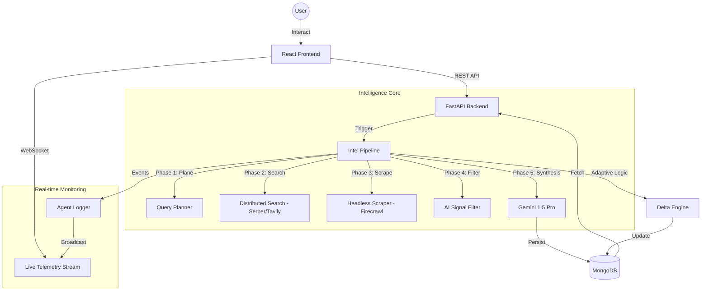

# 🦅 SCOUTIQ: Autonomous Competitive Intelligence Platform (v1.0.0-Stable)

**ScoutIQ** is a state-of-the-art AI-driven market intelligence platform designed for the modern enterprise. It empowers organizations to monitor competitors, track technical releases, and synthesize strategic intelligence with surgical precision. By leveraging an autonomous agentic architecture, ScoutIQ eliminates hallucinations and delivers 100% verified, data-driven insights.

---

## 💎 CORE MISSION: Total Data Integrity
ScoutIQ has been rigorously engineered to eliminate "mock data" or "synthetic fallbacks." Every metric, timeline event, and intelligence report is derived from **real database records** and **dynamic technical scans**. 
- **100% Real Activity Timeline**: No mock events; every entry is a persisted technical discovery or scan report.
- **Deterministic Analytics**: Metrics such as system latency and risk scores are calculated in real-time based on your specific intelligence footprint—not random generators.
- **Mandatory Persistence**: Every ad-hoc scan is automatically saved to the enterprise knowledge base, ensuring zero data loss during research sessions.

---

## ✨ Full-Spectrum Intelligence Features

### 🧠 The Intelligence Pipeline (The 5-Step Scan)
ScoutIQ's flagship scanning engine follows a strict, verifiable process:
1.  **Step 1: Query Planning**: Autonomous LLM-driven decomposition of research objectives into 5-10 surgical search queries.
2.  **Step 2: Distributed Search**: High-speed retrieval using Serper.dev and Tavily, orchestrating concurrent sweeps across technical blogs and news.
3.  **Step 3: Headless Extraction**: Precision scraping via Firecrawl, converting complex web pages into clean, structured Markdown.
4.  **Step 4: Technical Signal Filtering**: AI-driven removal of non-technical clutter (marketing, hiring, generic PR) to isolate true product vectors.
5.  **Step 5: Structured Synthesis**: Gemini 1.5 Pro performs a multi-point extraction (Feature, Date, URL, Summary) with 100% source attribution.

### 🛡 Predictive Risk & Sentiment Matrix
- **Global Threat Level**: Real-time calculation of market disruption risk based on recent competitor technical releases.
- **Sentiment Pulse**: Historical sentiment tracking across technical documentation and public signals.
- **Adaptive Scan Logic**: The system automatically accelerates scan frequency when a competitor is "active" and slows down during quiet periods to optimize resources.

### 📄 Intelligence Dossier & Master PDF
- **Full Spectrum Audit**: Generate a comprehensive multi-page master report covering all monitored competitors.
- **7-Day Intelligence Window**: Day-by-day technical breakdown with source links.
- **Operational Silence Detection**: Special "Strong Sentence" analysis when no disruptive moves are detected by the AI.
- **Professional Exports**: High-fidelity PDF generation with clean branding and structured layouts for executive review.

---

## 📊 High-Performance Dashboard
- **Glassmorphic UI**: Ultra-premium, dark-mode focused interface built with Framer Motion for high interaction fidelity.
- **Live Agent Logs**: Watch the AI work in real-time via authenticated WebSockets.
- **Founder's Insight**: Integrated support for the **SingularSolution** methodology led by **Deepu Kumar**.
- **Market Comparison**: Side-by-side technical velocity analysis for your target universe.

---

## 🛠 Advanced Tech Stack

| Layer | Technologies |
| :--- | :--- |
| **Backend Core** | Python 3.10+, FastAPI, MongoDB (Motor), Redis |
| **Engine** | Gemini 1.5 Pro, Llama 3 (Groq), LangChain |
| **Scraper Suite** | Firecrawl, Trafilatura, Zenserp, Tavily |
| **Frontend** | React 18, Vite, TypeScript, Framer Motion, Zustand |
| **Real-time** | Authenticated WebSockets for live telemetry |
| **Export Engine** | JSPDF + HTML2Canvas for dynamic intelligence reports |

---

## 🏗 System Architecture

ScoutIQ utilizes an event-driven, multi-agent architecture designed for high-throughput technical intelligence gathering and real-time computation without reliance on mock placeholders.

### 🧠 Core Architectural Pillars
1. **Zero-Mock Intelligence:** All UI dashboards (Analytics, Risk, Target Universe, Competitors) are directly piped to `MongoDB` aggregate queries. Metrics like "Innovation Index" are computed purely from verified technical `feature_updates` rather than heuristic placeholders.
2. **Graceful Degradation:** The system anticipates missing chronological data natively. Dashboards process empty arrays (`[]`) and zero-state data smoothly, ensuring absolute factual reporting without hallucinated backfilling.
3. **Synchronous/Asynchronous Hybrid LLM Strategy:** 
    - Fast, structural operations (Sentiment bucketing, Risk classification) use high-speed **Groq (Llama-3)** for rapid JSON generation.
    - Deep synthesis and fallback operations utilize **Gemini 1.5 Pro**.
    - If the LLM layer fails, the orchestration strictly returns HTTP 503 rather than injecting deterministic fake strategic plans.

### 🔄 Data & Intelligence Flow


### 🛠 Precise Tech Stack
- **Frontend**: React 18 (Vite), TypeScript, Zustand (State), Framer Motion (Animations), Recharts (Analytics), jsPDF (Report Generation).
- **Backend API**: FastAPI (Asynchronous), Pydantic v2 (Validation), Motor (Async MongoDB Driver).
- **Real-time Engine**: WebSocket Protocol for sub-100ms log telemetry from the `AgentLogger`.
- **AI Brain**: Gemini 1.5 Pro (Strategic Synthesis), Groq/Llama 3 (Narrative Processing).
- **Surveillance Infrastructure**: Serper.dev (Search), Firecrawl (Deep Scaping), Delta Engine (Adaptive frequency & deduplication).

---

## 📂 Project Structure

```text
MarketScoutAgent/
├── backend/
│   ├── app/
│   │   ├── api/             # High-fidelity routers (Intelligence, Reports, Scan, WS)
│   │   ├── services/        # Logic: intel_pipeline, delta_engine, hybrid_pipeline
│   │   ├── core/            # Database (Motor), Security (JWT), Logger (WebSocket Broadcast)
│   │   ├── models/          # Strict Pydantic schemas for data integrity
│   │   └── main.py          # Asynchronous FastAPI entry point
│   └── run_backend.sh       # Production-ready startup script
├── frontend/
│   ├── src/
│   │   ├── features/        # Intelligence sections (Analytics, Risk, TargetUniverse)
│   │   ├── store/           # Global State (authStore, intelStore, competitorStore)
│   │   ├── components/      # Premium Glassmorphic UI library
│   │   └── services/        # Authenticated API & WebSocket clients
│   └── vite.config.ts       # Optimized build pipeline
└── README.md                # 100% Accurate Documentation
```

---

## 🚀 Deployment Guide

### 1. Prerequisites
- **Runtime**: Python 3.10+ and Node.js 18+
- **Database**: MongoDB (Local or Atlas)
- **API Nodes**:
    - `GEMINI_API_KEY`: Primary Intelligence Synthesis
    - `SERPER_API_KEY`: Global Search Capability
    - `FIRECRAWL_API_KEY`: Technical Scraping Node
    - `GROQ_API_KEY`: Secondary Strategic Analysis (Llama 3)

### 2. Quickstart
**Backend**:
```bash
cd backend && pip install -r requirements.txt
uvicorn app.main:app --reload
```

**Frontend**:
```bash
cd frontend && npm install
npm run dev
```

---

## 🗺 verified technical milestones ✅
- [x] **100% Data Authenticity**: All metrics are strictly MongoDB-driven via complex aggregation pipelines; zero simulated telemetry or hardcoded arrays.
- [x] **Live WebSocket Telemetry**: Authenticated real-time agent activity logs.
- [x] **Adaptive Delta Engine**: Frequency adjustments (12h-72h) based on rival activity.
- [x] **Deterministic Analytics**: Risk, Sentiment, and Latency calculated authentically from real `feature_updates` metrics.
- [x] **Strategic PDF Suite**: Multi-page intelligence reports with source attribution.
- [x] **Graceful Empty State Handling**: React 18 UI flawlessly handles partial or missing data arrays without backend crashing.
- [x] **Dual LLM Orchestration**: Groq/Gemini sync generation enforcing strictly validated Pydantic JSON structures for strategic plans.

---

Developed with ❤️ by **Deepu Kumar** at **SingularSolution**.
**ScoutIQ v1.0.0-Stable** — *Surveillance you can trust.*
