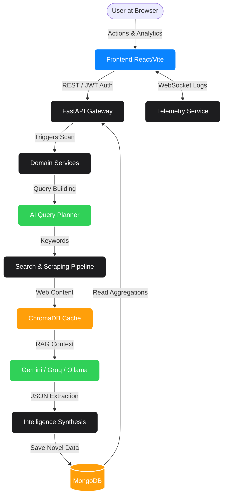

<div align="center">
  <h1>🦅 Sentry IQ (Sentry IQ)</h1>
  <p><strong>Enterprise-Grade Autonomous Competitive Intelligence Platform</strong></p>
  <p>
    
    
    
    
    
  </p>
</div>

---

## Table of Contents

1. [Project Title and Description](#1-project-title-and-description)
2. [Product Overview](#2-product-overview)
3. [Core Features](#3-core-features)
4. [System Architecture](#4-system-architecture)
5. [Tech Stack](#5-tech-stack)
6. [📂 Project Directory Structure](#6--project-directory-structure)
7. [Local Development Setup](#7-local-development-setup)
8. [Docker Setup](#8-docker-setup)
9. [API Documentation](#9-api-documentation)
10. [Security Best Practices](#10-security-best-practices)
11. [Testing Instructions](#11-testing-instructions)
12. [Deployment Guide](#12-deployment-guide)
13. [Monitoring and Logging](#13-monitoring-and-logging)
14. [CI/CD Pipeline](#14-cicd-pipeline)
15. [Contribution Guide](#15-contribution-guide)
16. [License](#16-license)
17. [Maintainer Information](#17-maintainer-information)
18. [Contact Information](#18-contact-information)

---

## 1. Project Title and Description

**Sentry IQ (Sentry IQ)**

**The Business Problem:** Modern enterprises and strategic teams struggle to synthesize the overwhelming volume of unstructured market data, technical product updates, and competitor intelligence. Manual tracking leads to delayed strategic decisions, and standard LLMs often hallucinate facts without grounded data.
**Product Value:** Sentry IQ automates the entire intelligence lifecycle. It actively orchestrates background web sweeps, scrapes technical blogs, and analyzes GitHub repositories. By mapping raw noise into deterministic, hallucination-free insights, it delivers verified, actionable intelligence.
**Real-World Use Cases:**
- **Product Managers:** Dynamically monitoring competitor feature rollouts and release velocity.
- **Strategy Teams:** Evaluating market disruption threats and predicting competitor roadmaps.
- **Data Analysts:** Replacing manual web scraping with autonomous AI agents that generate PDF dossiers directly from live intelligence.

---

## 2. Product Overview

Sentry IQ is an autonomous competitive intelligence SaaS platform.
- **What it does:** It tracks designated enterprise competitors using scheduled search pipelines, headless scrapers, and multi-tier AI models to synthesize product updates, pricing changes, and infrastructure shifts.
- **Who uses it:** Enterprise strategy officers, product managers, venture capital analysts, and technical researchers.
- **Why it matters:** It operates on a strict "Zero Mock Data" policy, ensuring every metric, timeline event, and threat score is rooted in live, traceable source URLs, thus eliminating AI hallucination risks.

---

## 3. Core Features

- **Authentication and Authorization:** Secure JWT token-based authentication protecting API endpoints and user dashboards.
- **Competitor Analysis:** Real-time tracking of added competitors, automatically categorizing updates by domain (API, UI, Infrastructure, Security, Platform).
- **Market Intelligence:** Synthesis of news, PR, and technical blogs into structured data points.
- **AI Insights:** Automated extraction of feature updates, publication dates, and confidence scores.
- **Predictive Analytics:** Velocity mapping of competitor updates over 7, 30, and 90-day windows.
- **Risk Analysis:** Calculation of competitive threat levels based on deployment momentum.
- **Dashboard Analytics:** Interactive React/Recharts visualizations mapping historical competitor activity.
- **Scheduler Automation:** Background tasks powered by `APScheduler` for autonomous, interval-based intelligence gathering.
- **WebSocket Live Updates:** Real-time pipeline execution logs streamed directly to the dashboard via `/ws/logs`.
- **Notification System:** SMTP-based email service for intelligence report delivery.
- **PDF Report Generation:** Automated compilation of competitor intelligence into formatted PDF dossiers.
- **GitHub Intelligence:** Dynamic fetching of competitor open-source repository statistics, languages, and stargazer momentum.
- **Financial Intelligence:** Real-time stock movement, market cap, and revenue signals via Alpha Vantage and Finnhub.
- **Company Firmographics:** Detailed profiles, funding data, and employee growth via Clearbit and Crunchbase.
- **Community Signals:** Aggregation of social sentiment and developer discussions from Reddit and YouTube.
- **Market News Hub:** Automated tracking of competitor press releases and acquisitions via NewsAPI.
- **Search Visibility:** SEO ranking and ad density tracking utilizing SerpAPI.
- **Scraping Pipelines:** Headless raw markdown extraction via Firecrawl and custom scrapers.
- **Cache Services:** High-speed vector caching with ChromaDB and Redis.
- **Telemetry and Logging:** Sentry DSN integration and centralized standard logging.

---

## 4. System Architecture

The application is built on an enterprise domain-driven design (DDD) monorepo architecture orchestrated by Turborepo.

### Architecture Flow Diagram



### Frontend Layer
- **Core:** React + TypeScript + Vite.
- **UI Components:** Modular glassmorphic designs using Tailwind CSS and Framer Motion.
- **State Management:** Global state handled via Zustand.
- **Context Providers:** AuthContext for session propagation.
- **Hooks:** Custom hooks for API communication and WebSocket subscriptions.
- **Dashboard Pages:** Comprehensive overviews of monitored competitors.
- **Analytics Pages:** Predictive analytics charts and risk matrices.
- **Authentication Flows:** Login, registration, and JWT interceptors.
- **API Communication:** Axios instances with automatic token injection.

### Backend Layer
- **Core:** FastAPI architecture running on Uvicorn.
- **REST APIs:** Typed endpoints utilizing Pydantic v2 schemas.
- **Authentication Services:** Bcrypt hashing and stateless JWT validation.
- **Domain Services:** Strictly separated logic (`auth`, `competitors`, `users`, `scan`, `notifications`, `intelligence`, `reports`).
- **Business Logic:** Centralized handling of data normalization and UI projection.
- **Scheduler Jobs:** Background asynchronous tasks running autonomous intelligence scans.
- **WebSocket Services:** Broadcasting live terminal execution logs to the frontend.
- **Notification Services:** Email delivery pipelines.
- **PDF Generation:** Asynchronous report building pipelines.
- **GitHub Integrations:** Authenticated API requests to map repository metrics.

### AI Intelligence Layer
- **Agent Orchestration:** Complex workflow management routing tasks from Query Planners to Synthesizers.
- **Prompt Engineering:** Strict system instructions enforcing structured JSON outputs.
- **Gemini Integration:** Primary LLM (Gemini 1.5 Pro/Flash) for deep strategic synthesis and complex extraction.
- **Groq Integration:** Speed-optimized inference for structural operations like sentiment bucketing.
- **OpenAI Integration:** Foundation configurations established in `config.py` for GPT-4o extensibility.
- **Anthropic Integration:** Architecture mapped for future Claude 3.5 Sonnet support for advanced reasoning.
- *(Note: The system fails over gracefully to a local **Ollama** model during cloud outages)*
- **Competitive Intelligence Generation:** LSA compression and AI extraction of technical signals.
- **Report Generation:** LLM-driven executive summary creation.

### Data Processing Layer
- **Scraping Pipelines:** Traversing target domains to extract raw Text/Markdown.
- **Search Pipelines:** Querying broad news and PR sources.
- **Data Normalization:** Regex cleaning, deduplication, and source verification.
- **Cache Services:** Local ChromaDB for rapid RAG operations.
- **Analytics Pipelines:** Aggregation of temporal data to build velocity metrics.

### Infrastructure Layer
- **Docker Containers:** Foundational `docker-compose.yml` for unified service orchestration.
- **CI/CD Pipelines:** Ready for automated lint/test/build validation via Turborepo caching.
- **Deployment Configs:** Standardized `.env` loaders and production scripts.
- **Logging:** Centralized Python loggers and WebSocket emitters.
- **Monitoring:** Prepared for external APM tracking.

### Security Layer
- **Authentication:** Secure token generation and rotation.
- **Token Validation:** API Gateway enforcement of Bearer tokens.
- **Environment Isolation:** Zero hardcoded secrets; strict `.env` segregation.
- **API Protection:** CORS restriction and type-safe payloads.

### Architecture Flow
`User → Frontend (React) → API Layer (FastAPI) → Business Services → AI Services (Gemini/Groq/Ollama) & Data Pipelines (Tavily/Firecrawl) → Cache (ChromaDB) / Database (MongoDB) → Response`

---

## 5. Tech Stack

**Frontend:**
- React (18+)
- TypeScript
- Vite
- Tailwind CSS

**Backend:**
- FastAPI
- Python (3.9+)

**AI:**
- Gemini
- Groq
- Ollama
- OpenAI (Configuration Layer)
- Anthropic (Architecture Mapped)

**Infrastructure:**
- Docker
- Turborepo
- GitHub Actions (Pipeline Ready)

**Third-Party Intelligence Integrations:**
- **Search Agents:** Tavily, SerpAPI, Google Search
- **Scraping Infrastructure:** Firecrawl, Crawl4AI, Trafilatura
- **Company Intelligence:** Clearbit, Crunchbase, People Data Labs
- **Financial Data:** Alpha Vantage, Finnhub, Financial Modeling Prep
- **Social & News:** NewsAPI, GNews, Reddit, YouTube Data API
- **Version Control Intelligence:** GitHub REST API
- **Monitoring:** Sentry

---

## 6. 📂 Project Directory Structure

```text
Market_Scout_Agent_Final/
├── apps/
│   ├── backend/                     # Python FastAPI Backend
│   │   ├── src/
│   │   │   ├── core/                # Database connections, Security, Configs
│   │   │   ├── domains/             # Domain-Driven Submodules
│   │   │   │   ├── auth/            # JWT Token management
│   │   │   │   ├── competitors/     # CRUD & logic for target competitors
│   │   │   │   ├── intelligence/    # Intelligence routing and endpoints
│   │   │   │   ├── notifications/   # SMTP email alerts
│   │   │   │   ├── reports/         # PDF generation services
│   │   │   │   ├── scan/            # Pipeline execution & validation models
│   │   │   │   └── users/           # User management
│   │   │   ├── shared/              # Cross-domain logic
│   │   │   │   └── websockets.py    # Live telemetry broadcast
│   │   │   └── main.py              # Application Gateway entry
│   │   ├── .env                     # Secret variables
│   │   ├── requirements.txt         # Pip dependencies
│   │   └── package.json             # Turborepo scripts for backend
│   └── frontend/                    # React / TypeScript / Vite UI
│       ├── src/
│       │   ├── components/          # Reusable UI, Charts (Recharts), Modals
│       │   ├── features/            # Complex views (LogConsole, Reports)
│       │   ├── pages/               # Dashboard, RiskPage, PredictiveAnalytics
│       │   ├── store/               # Zustand state files
│       │   └── index.css            # Tailwind directives
│       ├── tailwind.config.js
│       ├── vite.config.ts
│       └── package.json             # NPM dependencies
├── packages/                        # Shared internal workspace libs
│   ├── config/
│   ├── constants/
│   ├── sdk/
│   ├── types/
│   ├── ui/
│   └── utils/
├── services/                        # Global AI & Data scraping services
│   ├── ai/                          # LLM agents, prompts, Gemini/Groq/Ollama clients
│   └── data/                        # Tavily & Firecrawl scraper pipelines
├── docs/                            # Internal architectural diagrams & specs
├── infrastructure/                  # Terraform / cloud deployment templates
├── scripts/                         # Shared bash/automation scripts
├── docker-compose.yml               # Unified container orchestrator
├── package.json                     # Root monorepo workspace configurations
└── turbo.json                       # Turborepo build & caching pipelines
```

---

## 7. Local Development Setup

### Prerequisites
- Node.js (v18+)
- Python (v3.9+)
- MongoDB (Running locally on `mongodb://localhost:27017`)
- (Optional) Local Ollama instance.

### Install Commands
Initialize the monorepo:
```bash
npm install
npm run setup
```

### ⚙️ Environment Configuration
Create an `.env` file in `apps/backend/` using the `.env.example` template:
```env
MONGODB_URL=mongodb://localhost:27017
DATABASE_NAME=scoutiq_db
SECRET_KEY=your_secure_jwt_secret
GEMINI_API_KEY=your_api_key
GROQ_API_KEY=your_api_key
OLLAMA_HOST=http://localhost:11434
EMAIL_USER=your_email@gmail.com
EMAIL_PASS=your_app_password
```

### Backend Setup
```bash
cd apps/backend
npm run start
```
*Backend runs on `http://localhost:8000`. Swagger available at `/docs`.*

### Frontend Setup
```bash
cd apps/frontend
npm run dev
```
*Frontend runs on `http://localhost:5173`.*

---

## 8. Docker Setup

A foundational `docker-compose.yml` is provided at the repository root. Once container images are defined, run:
```bash
docker-compose up --build -d
```

---

## 9. API Documentation

Interactive API documentation is generated automatically by FastAPI. Access it via:
- **Swagger UI:** `http://localhost:8000/docs`
- **ReDoc:** `http://localhost:8000/redoc`

---

## 10. Security Best Practices

- **Zero Exposure:** Hardcoded secrets are explicitly banned.
- **Pydantic Validation:** All API endpoints strictly validate ingress and egress data.
- **Stateless Auth:** JWT tokens are utilized for scalable, stateless security.
- **Rate Limiting:** Guardrails are placed to protect against LLM API exhaustion.

---

## 11. Testing Instructions

Backend tests run via `pytest`:
```bash
cd apps/backend
source venv/bin/activate
pytest tests/
```

Frontend builds are verified via Vite:
```bash
cd apps/frontend
npm run build
```

---

## 12. Deployment Guide

- **Frontend:** Target the `apps/frontend` directory for Vercel, Netlify, or AWS Amplify deployments. Ensure the build command is `npm run build`.
- **Backend:** Target `apps/backend` for AWS ECS, Render, or Railway. Ensure all `.env` variables are securely injected into the provider's secrets manager.

---

## 13. Monitoring and Logging

- **Sentry:** Supported via `SENTRY_DSN` configuration.
- **Real-Time Logs:** Administrators can view pipeline execution via the `/ws/logs` WebSocket connection directly in the UI.

---

## 14. CI/CD Pipeline

The monorepo leverages **Turborepo** to aggressively cache tasks. A typical CI workflow will run `turbo run build test lint` to concurrently validate the frontend and backend without repeating unchanged work.

---

## 15. Contribution Guide

1. Fork the repository.
2. Create your feature branch (`git checkout -b feature/NewAnalytics`).
3. Commit your changes using clean, descriptive human language.
4. Push to the branch (`git push origin feature/NewAnalytics`).
5. Open a Pull Request for review.

---

## 16. License

This platform is Proprietary software. All rights reserved. 
*(If applicable for future open-source, an Apache 2.0 or MIT license will be appended).*

---

## 17. Maintainer Information

**Deepu Kumar**  
Lead Architect & Developer  
Sentry IQ Platform

---

## 18. Contact Information

For enterprise deployments, architectural discussions, or API inquiries, please reach out via internal engineering communication channels or the designated project repository issues page.
