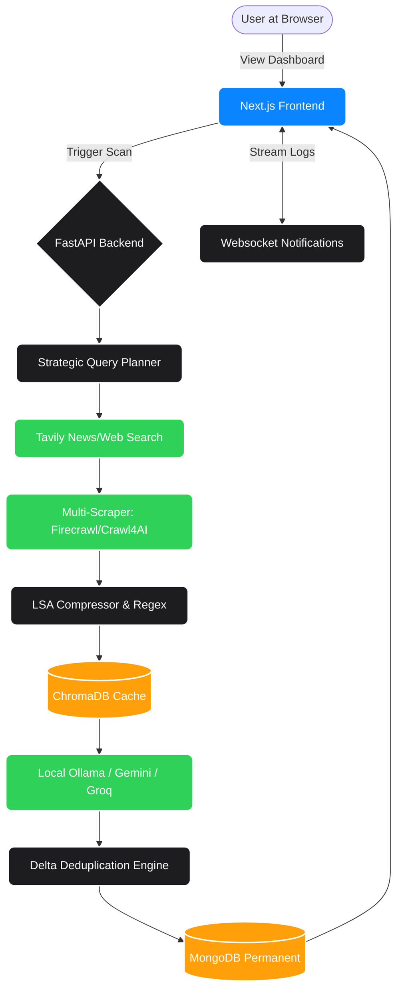

# 🚀 Market Scout Agent (Architecture Overview)

Welcome to **Market Scout Agent**! This document provides a high-level, visual breakdown of the entire application architecture. The goal here is to help developers, analysts, and contributors instantly understand how the massive amount of data flows from the open web into our polished Next.js dashboard.

---

## 🏗 System Architecture at a Glance

The platform is split into a **Next.js Frontend** (for sleek visualization) and a **FastAPI Backend** (the heavy-lifting AI engine). They communicate via REST APIs and real-time WebSockets.



---

## 📂 Project Directory Breakdown

Here is exactly where every sub-system lives:

```text
Market_Scout_Agent/
├── frontend/                # 🎨 Visual Interface (React/Next.js)
│   ├── src/components/      # UI Elements (Charts, Timelines, Buttons)
│   ├── src/features/        # Main Dashboard Logic
│   └── src/lib/             # API Connectors & Utilities
│
├── backend/                 # 🧠 The Core Intelligence Engine (Python/FastAPI)
│   ├── app/main.py          # Gateway initialization and routing
│   │
│   ├── app/api/             # 🔌 Communication Endpoints
│   │   ├── scan.py          # Triggers the massive 5-step agent
│   │   ├── intel_data.py    # Streams metrics to the frontend
│   │   └── websockets.py    # Streams real-time terminal logs to UI
│   │
│   ├── app/services/        # ⚙️ The Heavy Lifters (Business Logic)
│   │   ├── search_service.py      # Connects to Tavily API
│   │   ├── scraper_service.py     # Downloads Webpages & YouTube dates
│   │   ├── lsa_compressor.py      # Shrinks giant text chunks to save memory
│   │   ├── delta_engine.py        # Hashes features to block duplicates
│   │   └── ollama_sync.py         # Connects to LLaMA-3 locally
│   │
│   └── app/core/            # 🔐 System Configuration
│       └── config.py        # Loads `.env` secrets
│
└── docs/                    # 📚 Dedicated In-Depth Documentation
    ├── architecture.md      # Detailed subsystem explanations
    ├── pipeline.md          # 6-step LLM data filtration sequence
    └── setup_guide.md       # Environment deployment steps
```

---

## ⚙️ The 6-Step Autonomous Agent Workflow

When you click "Scan" on the dashboard, the backend triggers this massive sequence in real-time:

1. **Query Planning:** The LLM looks at the target company (e.g., "Apple") and brainstorms focused technical search requests (e.g., *"Apple iOS SDK updates last 7 days"*).
2. **Search Discovery:** The backend securely requests standard Google search results via the **Tavily API**, strictly bounding rules to only the last 7 calendar days.
3. **Headless Scraping:** We download the actual domains discovered in Step 2. We bypass strict bot guards using **Firecrawl** and **Crawl4Ai** to fetch pure Text/Markdown. (We also use Regex to extract strict Publication Dates, bypassing AI hallucination).
4. **Data Compression:** The text is scanned. Useless info (marketing, recruitment) is thrown out. **LSA Compressor** shrinks remaining data and hides it in a local **ChromaDB**.
5. **AI Synthesis:** The massive block of compressed evidence is passed to **Ollama** or **Gemini**. The AI responds dynamically in a strict, perfectly structured **JSON** format.
6. **Delta Verification:** The backend hashes the newly built JSON data. It compares hashes against **MongoDB**. If the update has never been seen before, it is successfully logged into the database and permanently added to your UI!

---

## 🛠 Tech Stack

- **Frontend:** Next.js (App Router), TailwindCSS, Recharts, Framer Motion, Lucide Icons.
- **Backend:** Python 3.10+, FastAPI, Pydantic, Motor (Async MongoDB).
- **Intelligence:** Ollama (LLaMA-3), Google Gemini, Groq, Trafilatura, BeautifulSoup.
- **Databases:** MongoDB (Permanent State), ChromaDB (Vector Search transient caching).
