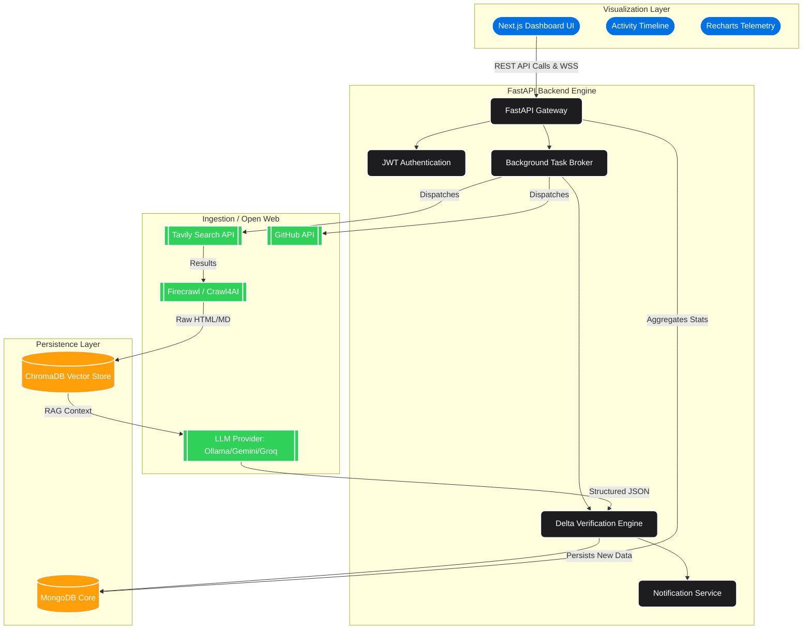

# Market Scout Analytics - Enterprise Architecture

Market Scout is an autonomous corporate intelligence platform designed to scrape, extract, and convert unstructured open-web competitor activity into structured, predictive technical insights.

## High-Level System Architecture

The architecture is divided into three primary layers: **Ingestion**, **Intelligence Processing**, and **Visualization**. 

## Layer Summaries

### 1. Client / Visualization Layer
Located in `/frontend`. Built on React and **Next.js**. It features a glassy, dark-mode prioritized interface tailored with TailwindCSS and Framer Motion for immediate understanding of intelligence streams without requiring user data manipulation.
- **Core Duty:** Stream dashboard statistics, present competitor trends via Recharts, map JSON metrics via dynamic components, and render YouTube inline intelligence.

### 2. Backend / Processing Engine
Located in `/backend`. Built on Python and **FastAPI**. Operating completely statelessly alongside asynchronous MongoDB execution.
- **Core Sub-Systems:**
  - **Delta Engine:** Hashes LLM-derived features into deterministic IDs to explicitly prevent duplicate records across multiple 7-day scans.
  - **Notification Engine & Websockets:** Pushes asynchronous updates to the client regarding newly discovered competitors or deep intelligence reports.
- **Core Duty:** Safely gatekeep user endpoints, cache search metrics, run background intelligence pipelines, and enforce strict Pydantic core schemas.

### 3. Intelligence Pipeline (The Agent)
The specialized logic controlling data refinement (see `pipeline.md` for in-depth sequencing).
- Searches via **Tavily**, parses difficult DOMs securely (overcoming bot-detection via **Firecrawl** or native **Crawl4AI**), checks technical vector validity via robust Regex, and compresses findings via Latent Semantic Analysis (`lsa_compressor`) and Token Guards before hitting LLaMA-3/Gemini.

### 4. Database Layer
- **MongoDB** stores persistent records grouped by user authentication (`users`, `competitors`, `feature_updates`, `reports`, `notifications`).
- **ChromaDB** acts as a stateless embedding tracker, ensuring rapid semantic lookup of scraped articles during the AI analysis phase to prevent hallucination.
