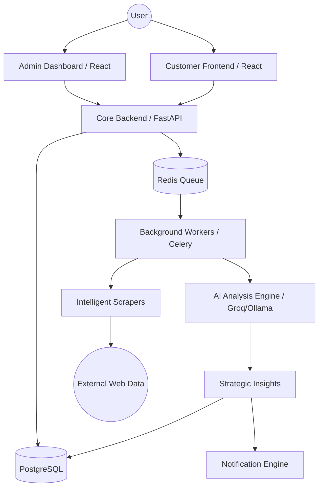

# ScoutForge AI - System Flow Architecture

This document describes the real-time data flow through the ScoutForge AI platform.

## High-Level Architecture

## Data Lifecycle

1. **Ingestion**: User adds a competitor via the Dashboard.
2. **Orchestration**: `platform` service validates the request and queues a "scan" job in Redis.
3. **Execution**: `worker` picks up the job, fetches live web data, and processes it through the AI pipeline.
4. **Analytics**: Processed results are stored in PostgreSQL and broadcasted to the Admin panel via WebSockets (or polling).
5. **Insights**: The system generates automated reports and alerts based on significant competitive movements.

## Deployment Model

The system is containerized and managed via Docker Compose (development) or Kubernetes (production).

- **API Layer**: Auto-scaled FastAPI instances.
- **Worker Layer**: Dynamic scaling based on Redis queue depth.
- **Frontend Layer**: Served via Nginx/CDN.
