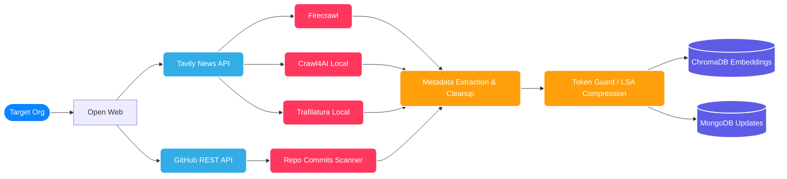

# Intelligence Data Sources & Processing

Market Scout is powered by a robust orchestration of open-source and proprietary intelligence channels. The engine securely discovers, retrieves, and processes fragmented information across the web into unified metadata via sophisticated token guards and caching layers.

## Provenance Model (Data Flow)

## 1. Tavily API (Search Discovery)
The engine utilizes Tavily to securely query real-time Google search indices mapped directly to the competitor node's name.
- **Why:** Bypass Google scraping limits and captchas automatically returning top-tier context vectors natively JSON parsed.
- **Constraints applied:** Hardcoded query boundaries natively restricted to the last 7 calendar days to prevent the LLM from surfacing obsolete historical updates inside dynamic timeline views.

## 2. Scraping Engine (Multi-Scraper & Fallback Sequences)
Headless scraping (`multi_scraper.py`, `scraper_service.py`) parses deeply nested, dynamic DOM components from articles and press releases.
- **Firecrawl API:** Primary processor for JavaScript-reliant domains like modernized React blogs. Returns cleansed Markdown with structured Schema metadata natively attached ensuring deterministic semantic analysis.
- **Crawl4AI & Trafilatura:** Open-source local fallbacks for async web extraction when Firecrawl endpoints throttle, guaranteeing parsing continuation.
- **Direct Regex:** Built-in Python BeautifulSoup script efficiently overrides missing page headers by targeting explicit HTML meta tags: `itemprop="datePublished"`, `uploadDate`, `article:published_time` alongside executing explicit regex extractions for text matching "Published Date: [Month Date, Year]" perfectly handling edge cases for plain-text tech deployments on platforms like Apple/YouTube.

## 3. GitHub Integrations (`github_client.py`)
Monitors technical shifts via the OSS ecosystem dynamically pulling from developers working under the company moniker.
- Correlates commits, software releases, and repos associated natively preventing the intelligence dashboard from missing purely structural backend pushes invisible on main corporate marketing portals.

## 4. Distillation Layers (LSA Compressor & Token Guard)
Since competitor intelligence generates thousands of pages of text per run, a raw LLM would suffer immediately via API-Limits or hardware Out-Of-Memory exceptions.
- **Token Guard:** Ensures text chunks don't aggressively exceed boundaries dynamically dropping excessively heavy and redundant markdown headers.
- **LSA Compressor:** Applies Latent Semantic Analysis mathematical models to shorten extracted documents into high-signal summaries exclusively containing core system definitions.

## 5. LLM Synthesis
The central intelligence processor that reads through compressed semantic chunks from `ChromaDB`.
- Supports lightweight local processing (`llama-3:8b-q4`) via Ollama securely keeping user surveillance vectors invisible.
- Exposes configurations for Google Gemini API or Groq API integrations mapped directly across to explicit Pydantic response structures for extremely fast validation schemas returning confident numerical metrics to power Rechart graphs.
