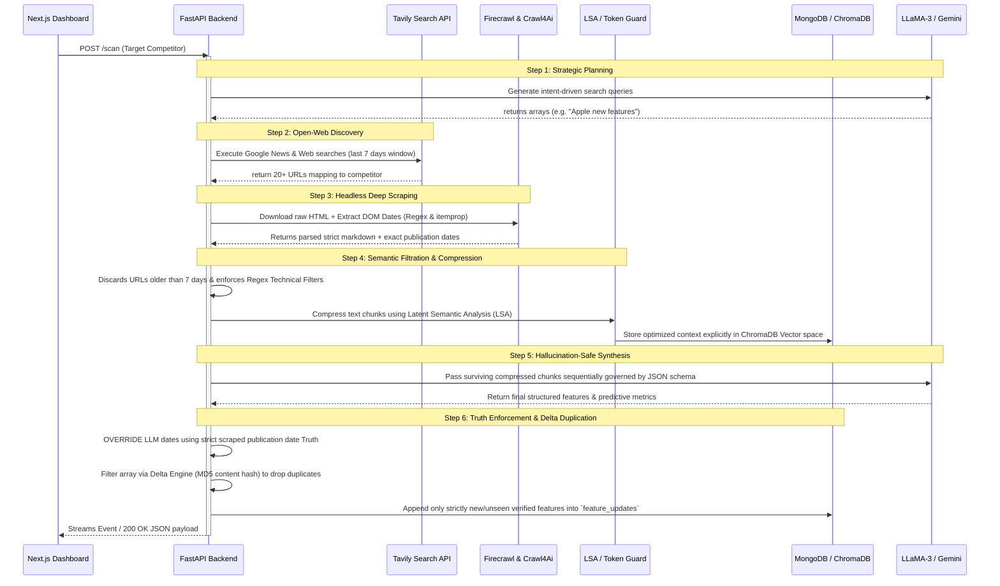

# The Intelligence Pipeline (Sequence Diagram)

The Market Scout Engine operates autonomously via a tightly regulated data filtration sequence. Its primary purpose: convert raw, unstructured open-web content into a structured, hallucination-free technical intelligence report.

## The Agentic Sequence

Below is the complete execution timeline generated instantaneously upon triggering a "Scan" for a competitor node:

## Detailed Breakdown

### Step 1: Strategic Query Planning (`query_planner.py`)
The pipeline runs the LLM model (local Ollama or remote Gemini/Groq) to intelligently brainstorm targeted web-search requests based on the competitor's profile structure and industry sector.

### Step 2: Tavily Web Search (`search_service.py`)
Executes the brain-stormed query batch against live Internet Search engines. Results are aggressively filtered leveraging temporal indices (e.g. `qdr:w`) to strictly force the engine to only surface 7-day-old intelligence.

### Step 3: Deep Trafilatura / Firecrawl Scraping (`scraper_service.py`)
Each web result is systematically downloaded using intelligent fallback trees. It predominantly relies on `Firecrawl` parsing logic to strip arbitrary JS bundles and extract clean core content.
**CRITICAL:** It aggressively mines standard HTML meta tags, YouTube specific `itemprop` properties (e.g., `datePublished`), and dynamic DOM elements for truth-based publication dates avoiding subsequent LLM chronological hallucination.

### Step 4: Content Compression (`lsa_compressor.py` & `token_guard.py`)
Non-technical noise (e.g., jobs, marketing, funding) is stripped out entirely matching negative regex blocks. The surviving dataset is further semantically flattened leveraging an `LSA Compressor` script to keep extraction limits inside LLM processing thresholds, avoiding Context-Window explosion. Context is persisted transiently to ChromaDB caching.

### Step 5: Structuring & Model Invocation (`intel_pipeline.py`)
Distilled chunks hit the primary Language Model matching explicit Pydantic response Schemas. The model categorizes whether the update represents an `API`, `UI`, `Infrastructure`, `Security`, etc.

### Step 6: The Date Override & Delta Caching (`delta_engine.py`)
Before executing any actual database inserts (`scan_pipeline.py`), the agent maps originally harvested **Step 3 publication dates** actively overwriting any date the LLM incorrectly guessed/imprinted. Features are then securely hashed. If the user ran a scan yesterday, the Delta engine instantly drops already known features, returning exclusively fresh unseen competitor activity sequentially ordered by legitimate open-web publication dates.
