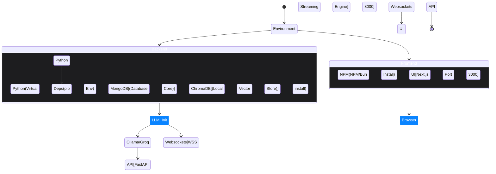

# Enterprise Setup & Deployment

The Market Scout Engine requires modern Python `>=3.10` and `Node.js >=18`. Full functionality scales dynamically maximizing available system computational nodes natively. It supports entirely local extraction via Ollama, dropping data transmission entirely.

## Initialization Sequence



## System Requirements
- **Hardware Profile:**
  - Mac / Windows WSL2 / Linux (Debian environments).
  - Minimum 16GB of System RAM if executing `OLLAMA` models locally to prevent GPU swap crashing.
- **Dependency Structures:**
  - Python 3.10+ (specifically leveraging `asyncio`)
  - Node.js 18+ (enabling Next.js Server Components)
  - MongoDB instance (MongoDB Atlas cluster or locally hosted).

---

## 1. Backend API Layer (`app/main.py`)

1. **Building Virtual Environments:**
Enforce encapsulated dependencies to avoid system polluting.
```bash
cd backend
python3 -m venv venv
source venv/bin/activate
pip install -r requirements.txt
```

2. **Configure Security & Configuration (`.env`)**
Modify the central variables seamlessly configuring behavior natively adapting the Python logic seamlessly:
```env
MONGODB_URL="mongodb://localhost:27017"
SECRET_KEY="replace-this-with-random-crypto"

# LLaMA Local (slow, maximum privacy)
LLM_PROVIDER="ollama" 
# OR execute blazingly-fast GenAI via Cloud nodes:
# LLM_PROVIDER="groq" 
# GROQ_API_KEY="..."

# Search Discovery APIs
TAVILY_API_KEY="..." 
# ^ Mandatory API Key required for open-web index querying overcoming bot detections natively.

# Specialized Parsing APIs (Optional but recommended)
FIRECRAWL_API_KEY="..."
```

3. **Launch Uvicorn Daemon**
Boot up the REST engine triggering threaded internal background agents:
```bash
# Recommended deployment shell
chmod +x run_backend.sh
./run_backend.sh

# Or direct invocation explicitly defining networking rules
uvicorn app.main:app --host 0.0.0.0 --port 8000 --reload
```

---

## 2. Frontend Application (Next.js)

The visualization layer provides the centralized intelligence dashboard, executing dynamic temporal charts via `Recharts`, managing bi-directional `websockets` streams natively observing background cron-jobs cleanly.

1. **Install NPM Modules:**
```bash
cd frontend
npm install # or bun install natively explicitly mapping tailwind dependencies.
```

2. **Initiate Next JS Server:**
```bash
npm run dev
```
Navigate securely to `http://localhost:3000` via your target browser.

## 3. Database Maintenance (Crucial)
The Delta processing engines rely entirely upon accurate historical MongoDB extraction points. If hallucinated constraints are saved inadvertently (e.g. YouTube metadata extraction bugs logging generic UI timestamps as actual `datePublished` truths), the local cache system preserves them entirely ruining analytics timeline structures permanently natively.

**Re-indexing Command:**
To cleanly eradicate corrupted semantic structures mapping the intelligence nodes perfectly via `mongosh`:
```bash
mongosh scoutiq_db --eval '
  db.feature_updates.deleteMany({}); 
  db.article_summaries.deleteMany({});
  db.reports.deleteMany({});'
```
This forces the backend API completely dumping historical arrays to fetch unadulterated live signals re-entering accurate JSON metadata correctly across subsequent UI requests!
